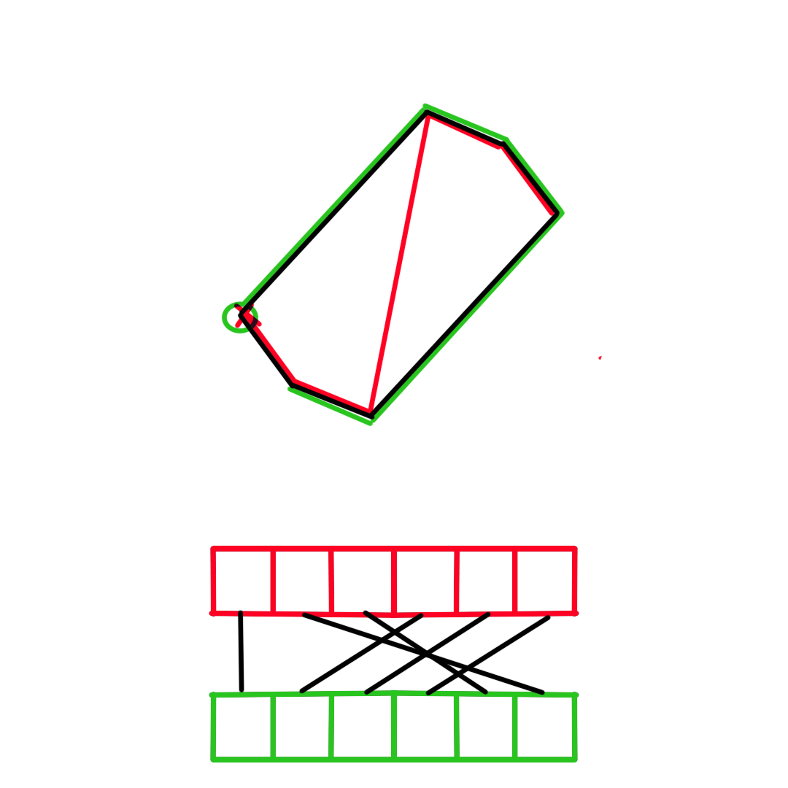

This is my project for the course "Parallele Systeme" at [H-KA](https://www.h-ka.de/).
Its goal is to show that I understood principles of parallel computing. 

There are two scripts here. Both calculate the average shadow of a unit-cube, one in serial and one in parallel. The initial idea came from a [video](https://www.youtube.com/watch?v=ltLUadnCyi0) by 3blue1brown. 

The implemented algorithm has the following steps:
* generate unit-cubes with origin as center
* generate rotations 
* rotate the cubes
* project the cubes
* calculate shadow area for each cube

The serial implementation does this over and over, appending the results to an array, then averaging over the array to get the result.

The paralell implementation does the same, except each "iteration" gets an index as identifier that is used to access the arrays holding the necessary information.

Since CUDA-kernel-functions do not play nice with non-standard libraries, some manual implementations as well as hard coded sections are used.

# Explanation for hexagon area
Since cubes can only throw convex, symmetric shadows, the hexagonal area of the shadow can be divided into four triangles and a parallelogram, the area of which are easy to calculate. Like so:

# Explanation for convex hull

If all points are sorted by their x-values into the red `array_x`, `array_x[0]` contains the the point marked with x. The following entries of the array are the points as they are traversed by the red line.
To sort the points along the convex hull, the green `array_hull` is filled with the points following the green line, starting with the circled point in `array_hull[0]`. To get `array_hull` from `array_x` the values from `array_x` are written into `array_hull` like indicated by the black lines between the arrays. This can be necessary in 4 different cases, illustrated by the following diagrams.

### Case 0

### Case 1

### Case 2

### Case 3

